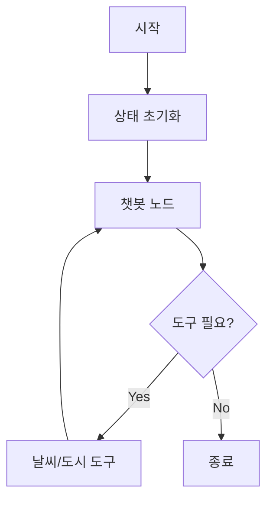
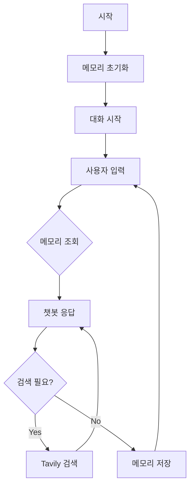

# LangGraph 예제 프로젝트

LangGraph는 LangChain 기반의 대화형 AI 워크플로우를 구축하기 위한 프레임워크이다. 상태 머신과 그래프를 활용하여 복잡한 대화 흐름을 관리한다.

## 예제 구성

### [Example 1: 기본 대화 에이전트](./examples/example1)
- 상태 관리를 통한 대화 기록 유지
- MessagesState를 활용한 메시지 관리
- 기본적인 대화 흐름 구현

### [Example 2: 날씨 정보 에이전트](./examples/example2)
- OpenAI Function Calling을 활용한 도구 통합
- 날씨 정보 조회 및 시원한 도시 목록 제공
- 도구 선택과 실행을 자동으로 처리


### [Example 3: 메모리 기반 대화 에이전트](./examples/example3)
- MemorySaver를 활용한 대화 기록 저장
- Thread ID 기반 다중 대화 관리
- Tavily 검색 도구 통합


## 시작하기

### 필수 요구사항
- Python 3.12 이상을 설치한다
- Poetry (의존성 관리)를 설치한다
- OpenAI API 키를 준비한다
- Tavily API 키를 준비한다 (Example 3용)

### 설치 과정
```bash
# Poetry를 설치한다
curl -sSL https://install.python-poetry.org | python3 -

# 의존성을 설치한다
poetry install
```

### 환경 설정
```bash
# Poetry 환경을 활성화한다
poetry shell

# API 키를 설정한다
export OPENAI_API_KEY=your_api_key_here
export TAVILY_API_KEY=your_tavily_api_key_here
```

### 예제 실행
```bash
# Example 1을 실행한다
poetry run python -m example1

# Example 2를 실행한다
poetry run python -m example2

# Example 3을 실행한다
poetry run python -m example3
```

## 프로젝트 구조
```
.
├── README.md
├── examples/
│   ├── example1/
│   │   ├── README.md
│   │   └── main.py
│   ├── example2/
│   │   ├── README.md
│   │   └── main.py
│   └── example3/
│       ├── README.md
│       └── main.py
├── pyproject.toml
└── poetry.lock
```

## 주요 기능

### Example 2 구현 사항
- 날씨 정보 조회 (서울/인천: 15도, 안개)
- 시원한 도시 목록 제공 (서울, 고성)
- StateGraph를 활용한 도구 통합
- 자동 도구 선택 및 실행

### Example 3 구현 사항
- 대화 맥락 유지 및 기억
- Thread ID 기반 다중 대화 관리
- Tavily 검색 도구를 통한 실시간 정보 검색
- 메모리 기반 개인화된 응답 생성

## 메모리 기능의 중요성

### 1. 대화 맥락 유지
- 이전 대화 내용을 기억하여 문맥에 맞는 응답을 생성한다
- 사용자의 이름, 선호도 등 개인 정보를 기억한다
- 이전에 나눈 대화를 참조하여 일관성 있는 대화를 진행한다

### 2. 다중 대화 관리
- Thread ID를 통해 여러 사용자와의 대화를 독립적으로 관리한다
- 각 대화의 맥락이 섞이지 않도록 분리한다
- 동시에 여러 대화를 처리할 수 있다

## 참고 자료
- [LangGraph 공식 문서](https://python.langchain.com/docs/langgraph)
- [LangChain 공식 문서](https://python.langchain.com/)
- [OpenAI API 문서](https://platform.openai.com/docs/api-reference)
- [Tavily API 문서](https://tavily.com/docs)

## 라이선스
MIT 라이선스
