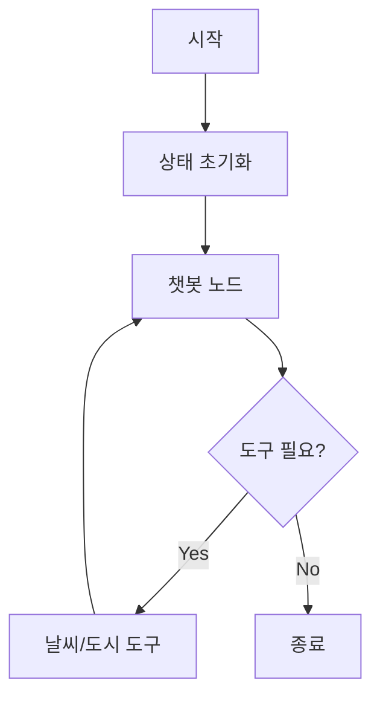

# LangGraph 예제 프로젝트

LangGraph는 LangChain 기반의 대화형 AI 워크플로우를 구축하기 위한 프레임워크입니다. 상태 머신과 그래프를 활용하여 복잡한 대화 흐름을 관리합니다.

## 예제 구성

### [Example 1: 기본 대화 에이전트](./examples/example1)
- 상태 관리를 통한 대화 기록 유지
- MessagesState를 활용한 메시지 관리
- 기본적인 대화 흐름 구현

### [Example 2: 날씨 정보 에이전트](./examples/example2)
- OpenAI Function Calling을 활용한 도구 통합
- 날씨 정보 조회 및 시원한 도시 목록 제공
- 도구 선택과 실행을 자동으로 처리


## 시작하기

### 필수 요구사항
- Python 3.12+
- Poetry (의존성 관리)
- OpenAI API 키

### 설치 과정
```bash
# Poetry 설치
curl -sSL https://install.python-poetry.org | python3 -

# 의존성 설치
poetry install
```

### 환경 설정
```bash
# Poetry 환경 활성화
poetry shell

# OpenAI API 키 설정
export OPENAI_API_KEY=your_api_key_here
```

### 예제 실행
```bash
# Example 1 실행
poetry run python -m example1

# Example 2 실행
poetry run python -m example2
```

## 프로젝트 구조
```
.
├── README.md
├── examples/
│   ├── example1/
│   │   ├── README.md
│   │   └── main.py
│   └── example2/
│       ├── README.md
│       └── main.py
├── pyproject.toml
└── poetry.lock
```

## 주요 기능

### Example 2 구현 사항
- 날씨 정보 조회 (서울/인천: 15도, 안개)
- 시원한 도시 목록 제공 (서울, 고성)
- StateGraph를 활용한 도구 통합
- 자동 도구 선택 및 실행

## 참고 자료
- [LangGraph 공식 문서](https://python.langchain.com/docs/langgraph)
- [LangChain 문서](https://python.langchain.com/)
- [OpenAI API 문서](https://platform.openai.com/docs/api-reference)

## 라이선스
MIT 라이선스
