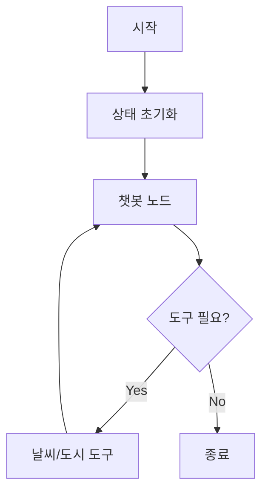
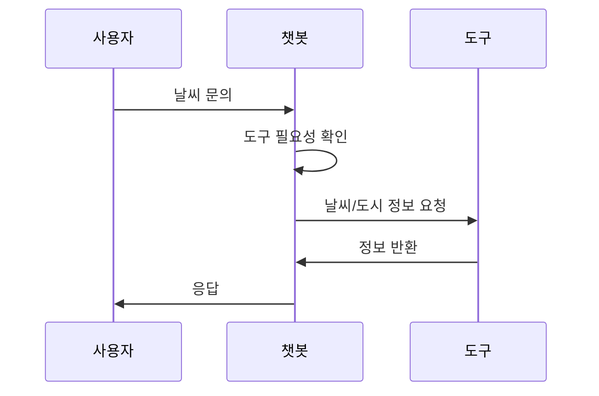

# LangGraph 도구 활용 에이전트

## 개요
이 프로젝트는 LangGraph를 사용하여 날씨 정보를 제공하는 대화형 에이전트를 구현합니다. 상태 관리와 도구 통합을 통해 실시간 날씨 정보를 제공할 수 있습니다.

## 프로젝트 구조


## 주요 기능

### 1. 날씨 정보 조회
- 특정 도시의 현재 날씨 정보 제공
- 서울/인천: 안개 낀 날씨 (15도)
- 기타 도시: 맑은 날씨 (32도)

### 2. 시원한 도시 목록
- 현재 가장 시원한 도시 목록 제공
- 기본 제공: 서울, 고성

## 구현 세부사항

### State 관리
```python
class MessagesState(TypedDict):
    messages: Annotated[list, add_messages]
```

### 도구 구현
```python
@tool
def get_weather(location: str) -> str:
    """특정 지역의 날씨 정보를 반환합니다"""
    ...

@tool
def get_coolest_cities() -> str:
    """가장 시원한 도시 목록을 반환합니다"""
    ...
```

## 워크플로우


## 설치 및 실행

### 필수 요구사항
- Python 3.12+
- OpenAI API 키

### 설치
```bash
pip install langchain langgraph langchain-openai
```

### 실행
```bash
python -m example2.main
```

## 사용 예시
```
User: 가장 시원한 도시의 날씨는 어때요?
Assistant: 서울의 날씨를 확인해보겠습니다...
현재 서울은 15도이고 안개가 끼었습니다.
```

## 주의사항
1. OpenAI API 키 설정 필요
2. 실제 날씨 데이터는 하드코딩됨
3. 도구 호출 실패 시 기본 응답 제공

## 확장 가능성
1. 실제 날씨 API 연동
2. 추가 도시 정보 확장
3. 상세 날씨 정보 추가

## 참고 자료
- [LangGraph 문서](https://python.langchain.com/docs/langgraph)
- [LangChain 문서](https://python.langchain.com/)