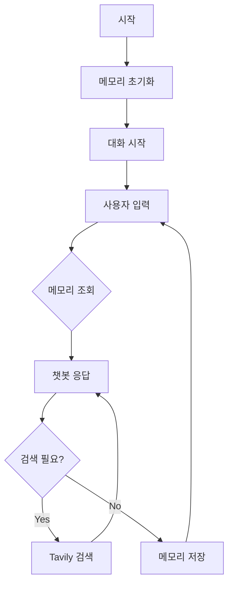

# LangGraph 메모리 기능을 활용한 대화형 에이전트

## 개요
이 프로젝트는 LangGraph의 메모리 기능을 활용하여 대화 맥락을 유지하는 챗봇을 구현한다. 메모리 기능이 없는 챗봇은 이전 대화를 기억하지 못하여 자연스러운 대화가 어렵다. 이를 해결하기 위해 MemorySaver를 도입하고 thread_id를 활용하여 여러 대화를 구분하여 관리한다.

## 메모리의 중요성

### 1. 대화 맥락 유지
- 이전 대화 내용을 기억하여 문맥에 맞는 응답을 생성한다
- 사용자의 이름, 선호도 등 개인 정보를 기억한다
- 이전에 나눈 대화를 참조하여 일관성 있는 대화를 진행한다

### 2. 다중 대화 관리
- Thread ID를 통해 여러 사용자와의 대화를 독립적으로 관리한다
- 각 대화의 맥락이 섞이지 않도록 분리한다
- 동시에 여러 대화를 처리할 수 있다

### 3. 대화 품질 향상
- 반복적인 질문을 피할 수 있다
- 사용자 맞춤형 응답을 제공한다
- 자연스러운 대화 흐름을 유지한다

## 프로젝트 구조


## 구현 세부사항

### 1. 메모리 설정
```python
memory = MemorySaver()
graph = graph_builder.compile(checkpointer=memory)
```

### 2. Thread ID 관리
```python
def test_chatbot(graph, question: str, thread_id: str = "default"):
    config = {"configurable": {"thread_id": thread_id}}
    # ... 대화 처리 로직
```

## 사용 예시

### 첫 번째 대화 (철수)
```
User: 내 이름은 철수야
Assistant: 안녕하세요, 철수님!

User: 내 이름이 뭐였지?
Assistant: 철수님이십니다!

User: 나는 학생이야
Assistant: 네, 철수님은 학생이시군요!
```

### 두 번째 대화 (영희)
```
User: 안녕! 내 이름은 영희야
Assistant: 안녕하세요, 영희님!

User: 내 이름이 뭐였지?
Assistant: 영희님이십니다!

User: 나는 선생님이야
Assistant: 네, 영희님은 선생님이시군요!
```

## 설치 및 실행

### 필수 요구사항
- Python 3.12 이상을 설치한다
- OpenAI API 키를 준비한다
- Tavily API 키를 준비한다

### 환경 설정
```bash
# 필요한 패키지를 설치한다
pip install langchain langgraph langchain-openai python-dotenv

# .env 파일을 생성하고 API 키를 설정한다
OPENAI_API_KEY=your-openai-api-key
TAVILY_API_KEY=your-tavily-api-key
```

### 실행 방법
```bash
python -m example3.main
```

## 확장 가능성

### 1. 저장소 확장
- 현재는 메모리에만 저장하지만 데이터베이스 연동이 가능하다
- Redis, MongoDB 등 영구 저장소를 활용할 수 있다

### 2. 메모리 관리 개선
- 오래된 대화는 자동으로 삭제한다
- 중요도에 따라 메모리를 선별적으로 유지한다
- 메모리 용량을 효율적으로 관리한다

### 3. 기능 확장
- 다양한 검색 도구를 추가한다
- 사용자 프로필 관리를 강화한다
- 대화 분석 기능을 추가한다

## 주의사항
1. API 키를 안전하게 관리한다
2. 메모리 사용량을 모니터링한다
3. 개인정보 보호에 유의한다

## 참고 자료
- [LangGraph 공식 문서](https://python.langchain.com/docs/langgraph)
- [LangChain 공식 문서](https://python.langchain.com/)
- [Tavily API 문서](https://tavily.com/docs)
