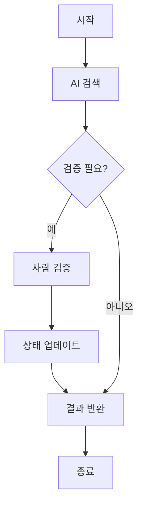

# LangGraph Example 5: State Customization and Information Verification 🔍

이 예제는 LangGraph에서 커스텀 상태를 관리하고 정보의 정확성을 사람이 검증하는 방법을 보여다. 웹 검색과 사람의 검증을 결합하여 정확한 정보를 관리할 수 있다.

## 시스템 구조


## 주요 기능 🎯

1. 커스텀 상태 관리
   - `name`과 `birthday` 필드 추가
   - 상태 자동/수동 업데이트 가능
   - 검증된 정보 저장

2. 검증 시스템
   - AI가 찾은 정보 검증
   - 사람의 승인/수정 기능
   - 실시간 정보 업데이트

3. 정보 추적
   - 검증 이력 관리
   - 상태 변경 추적
   - 수동 상태 수정


## 환경 설정
```python
# .env
OPENAI_API_KEY=your-openai-api-key
```

## 사용 예시 💡

```python
# 정보 검색 및 검증
user_input = "LangGraph의 출시일을 찾아주세요."
test_information_lookup()

# 출력 예시
🔍 검색 결과: "2024년 출시 예정"
👋 검증이 필요합니다!
✅ 수정된 정보: "Jan 17, 2024"
```

## 주요 구성 요소 📚

1. `State` 클래스
```python
class State(TypedDict):
    messages: Annotated[list, add_messages]
    name: str
    birthday: str
```

2. `human_assistance` 도구
```python
@tool
def human_assistance(name: str, birthday: str, tool_call_id: str) -> str:
    """정보 검증을 요청합니다."""
    # 구현 내용
```

## 확장 가능성 🚀

1. 검증 프로세스
   - 다중 검증자 지원
   - 자동 검증 규칙 추가
   - 검증 이력 관리

2. 상태 관리
   - 추가 필드 확장
   - 상태 백업 기능
   - 이력 추적 강화

## 주의사항 ⚠️

1. 상태 관리
   - 상태 업데이트 순서 중요
   - 검증 없이 상태 변경 주의
   - 동시성 고려 필요

2. API 사용
   - API 키 필요
   - 호출 제한 고려
   - 에러 처리 필수

## 참고 자료 📖

- [LangGraph 공식 문서](https://python.langchain.com/docs/langgraph)
- [상태 관리 가이드](https://python.langchain.com/docs/langgraph/concepts)

이 예제를 통해 AI와 사람의 협업으로 정확한 정보를 관리하는 시스템을 구현할 수 있다.